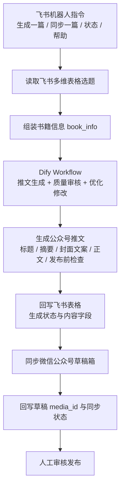
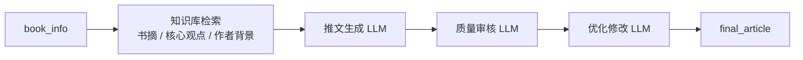

# Content-Agent 项目说明书

## 项目一句话介绍

基于飞书机器人 + Dify Workflow + 微信公众号 API 的读书推文自动生成与草稿同步系统，帮助内容运营人员把“选题表格”一键转化为“可审核发布的公众号草稿”。

## 项目成品图


## 项目定位

这个项目不是单纯“调用大模型写文章”，而是围绕公众号内容生产流程做的一套 AI 内容运营工作流：

- 面向对象：读书类公众号运营人员、内容实习生、个人内容创作者。
- 核心目标：减少重复写作和搬运操作，让运营人员把时间更多放在选题判断、内容审核和发布决策上。
- 产品价值：把内容生产从“人工复制粘贴”升级为“指令触发、状态可追踪、草稿可同步”的半自动化链路。

## 业务痛点

### 原始人工流程


### 主要问题

| 痛点 | 具体表现 | 影响 |
| --- | --- | --- |
| 重复劳动多 | 每篇文章都要重复整理书籍信息、写标题、写正文、复制到后台。 | 单篇内容耗时长，规模化生产困难。 |
| 内容格式不稳定 | 不同时间写出的标题、摘要、正文结构不一致。 | 影响账号调性和发布效率。 |
| 状态难追踪 | 选题是否已生成、是否已同步草稿、失败原因分散在人工记录中。 | 多篇内容并行时容易漏处理。 |
| 人工同步耗时 | 生成后还要登录公众号后台手动创建草稿。 | 运营流程被低价值操作打断。 |
| AI 输出不可控 | 直接让大模型写文章时，容易空泛、跑题、结构不符合公众号发布习惯。 | 仍需要大量人工返工。 |

## 系统流程图



## 核心功能

- 飞书机器人指令触发：支持 `生成一篇`、`同步一篇`、`状态`、`帮助`。
- 选题表格读取：从飞书多维表格读取待生成内容。
- AI 推文生成：调用 Dify Workflow 生成读书推文。
- 结构化结果回写：把标题、摘要、封面文案、正文、发布前检查写回飞书。
- 微信草稿同步：将已生成内容同步到微信公众号草稿箱。
- 状态追踪：记录是否已生成、是否已同步草稿、失败原因和草稿 media_id。

## Dify 工作流设计

当前 Dify DSL 文件位于 `dify/book_article_agent.dsl.yml`，工作流定位是“读书公众号推文生成器”。

### 输入变量

| 输入变量 | 类型 | 说明 |
| --- | --- | --- |
| `book_info` | paragraph | 由飞书表格字段拼接而成，包含书名、作者、分类、目标读者、推荐角度、核心关键词、标题方向和适合人群。 |

示例结构：

```text
书名：……
作者：……
分类：……
目标读者：……
推荐角度：……
核心关键词：……
标题方向：……
适合人群：……
```

### 大模型节点

| 节点 | 作用 | 产品设计目的 |
| --- | --- | --- |
| 用户输入 | 接收 `book_info`。 | 让外部系统只需要传入结构化选题信息。 |
| 推文生成 | 根据书籍信息生成公众号读书推文初稿。 | 解决从 0 到 1 写作的问题。 |
| 内容质量审核 | 检查内容是否符合发布要求。 | 降低 AI 直接输出带来的质量波动。 |
| 推文优化修改 | 根据审核结果优化标题、正文和结尾。 | 让输出更接近可发布草稿。 |
| 输出 | 返回 `article`、`review`、`final_article`。 | 方便 Python 服务解析并回写表格。 |

### 知识库检索设计
 Dify 中增加 Knowledge Retrieval 节点：



这样可以把书籍资料、历史爆款文章、账号写作规范沉淀进知识库，让生成内容更有依据。

### 输出结果

| 输出字段 | 说明 | 系统处理 |
| --- | --- | --- |
| `article` | 初稿内容。 | 可作为过程产物保留。 |
| `review` | 内容审核和修改建议。 | 回写为审核结果。 |
| `final_article` | 最终推文。 | 拆分为标题、摘要、封面文案、公众号正文、发布前检查。 |

## Prompt 与 RAG 设计

### 初始普通 Prompt

```text
请根据书名、作者、核心观点、推荐理由和知识库资料，生成一篇适合公众号发布的读书推文。

要求：
1. 标题有吸引力，适合公众号读书号。
2. 开头点出这本书对目标读者的价值。
3. 正文包含 3 个推荐理由，并结合书籍内容展开。
4. 语言面向大学生、应届生和职场新人。
5. 结尾引导读者收藏、转发或阅读原书。
6. 输出包含最终标题、文章摘要、封面文案、公众号正文和发布前检查。
```

这个 Prompt 的问题是：输入信息太少，模型容易生成泛泛而谈的文章，标题和正文结构也不稳定。

### 优化后的 Prompt 思路

```text
你是一名微信公众号读书号编辑，主要为大学生、应届生和职场新人撰写实用型读书推荐文章。

你的任务是：根据用户提供的书籍信息，生成一篇适合微信公众号发布的读书推荐推文。

【账号定位】
面向大学生、应届生和职场新人的实用读书推荐号。每篇文章用一本书回应一个具体问题，例如迷茫、焦虑、拖延、表达、求职、赚钱、职业选择、认知提升。

【写作目标】
这篇文章不是书籍百科，也不是读书笔记，而是一篇“问题解决型读书推荐文”。
你要让读者看完后觉得：
1. 这个问题我也有；
2. 这本书确实和我有关；
3. 文章里至少有 1-2 个观点能立刻用到生活、学习或职场中。

【写作风格】
1. 语言自然，有公众号阅读节奏，不要像论文、百科或广告。
2. 多写具体生活场景，少写抽象概念。
3. 每个观点都要结合大学、求职、职场新人、人际关系中的具体场景解释。
4. 不要编造书中不存在的情节、案例、作者经历、销量、奖项、读者反馈。
5. 不要大段引用原书内容。
6. 不要使用夸张表达，例如“彻底改变人生”“必读神书”“看完逆袭”“封神之作”“人生答案”。
7. 不要输出虚假的亲身经历，例如“我读完这本书后如何如何”。
8. 字数控制在 1200-1600 字。
9.不要使用“小王”“小李”“小明”等模板化人物举例，优先使用“你可能遇到过这样的情况”这类第二人称场景。

【内容要求】
文章必须围绕用户提供的“推荐角度”展开。
如果输入中有“标题方向”，标题要围绕这个方向优化。
如果输入中有“核心关键词”，正文中要自然融入，但不要机械堆砌。

【书籍推荐露出规则】
当前推荐书籍是：{{book_name}}
作者是：{{author}}
请确保文章始终围绕当前书籍展开，严禁写成其他书籍，严禁混入其他书籍的核心观点。
正文中必须自然出现书名，规则如下：
【最终标题】中优先包含书名，例如：
读完《{{book_name}}》，我终于明白……
《{{book_name}}》：……
如果你最近……，建议读读《{{book_name}}》
如果标题为了传播效果没有直接写书名，那么【公众号正文】前 150 字内必须自然出现完整书名。
正文开头不能一直用“这本书”“它”“这本作品”代替书名。第一次提到时必须写完整书名：
今天想推荐的，是《{{book_name}}》。
最近重读《{{book_name}}》，我发现它真正打动人的地方不是……
如果你也正在被……困住，可以翻开《{{book_name}}》。
正文中至少自然出现 3 次书名：
开头 1 次：明确告诉读者推荐的是哪本书；
中段 1 次：回到书中观点或阅读感受；
结尾 1 次：自然收束推荐理由。
不要机械重复书名。第一次出现用完整书名，后面可以交替使用：
《{{book_name}}》
这本书
书里
作者在书中提醒我们
不要把书名生硬塞进句子里。书名出现的位置应该服务于推荐逻辑：
引出推荐对象；
承接书中观点；
总结适合谁读。
如果当前书名已经带有书名号，不要重复添加书名号；如果没有书名号，输出时使用《{{book_name}}》。

【输出格式】
请严格按照以下结构输出：

一、公众号标题
给出 6 个标题。
要求：
- 标题要具体，有问题感或场景感；
- 不要标题党；
- 不要夸张承诺；
- 至少 2 个标题要面向大学生或职场新人。

二、文章摘要
生成一段 60-80 字摘要。
要求：说明这本书解决什么问题、适合谁读。

三、封面文案
生成 3 条封面文案。
要求：每条不超过 16 个字，适合放在公众号封面图上。

四、正文

1. 开头痛点
用一个具体场景开头。
不要直接介绍书。
先写读者在生活、学习、求职或职场中遇到的真实困扰，再自然引出这本书。

2. 这本书讲了什么
用通俗语言介绍这本书的核心内容。
不要写成百科介绍。
要说明它为什么和“减少内耗、在意评价、讨好别人、自我接纳”等问题有关。

3. 为什么推荐这本书
结合大学生、应届生和职场新人的处境，说明这本书的现实意义。
要具体写到：求职、社交、实习、职场反馈、人际关系中的至少 2 个场景。

4. 三个核心启发

请输出 3 个启发，每个启发使用以下自然文章格式：

【启发标题】

第一段：用自然语言解释这个观点，不要出现“解释这个观点是什么”这类提示词原文。

第二段：结合一个大学生、应届生或职场新人的现实场景进行说明。场景要具体，但不要使用“小王”“小李”这类过于模板化的人名。

第三段：给出一个可以尝试的小建议。建议要具体、可执行，但不要写成命令式清单。

注意：
- 不要把格式说明原样写进正文。
- 不要使用“解释这个观点是什么”“给出一个可以尝试的小建议”“举一个现实场景”等提示词原文。
- 每个启发控制在 180-260 字。
- 三个启发之间要有明显差异，不要反复表达同一个意思。

5. 适合哪些人读
用 4-6 条简短句子列出适合人群。

6. 一句话总结
用一句自然、有记忆点的话总结这本书的价值。
不要夸张，不要鸡汤。

7. 互动问题
提出一个适合放在文末的问题，引导读者留言。
问题要具体，不要太空。
```

### 从“普通生成”到“结合资料生成”

| 阶段 | 做法 | 效果 |
| --- | --- | --- |
| 普通生成 | 只告诉模型“写一篇读书推文”。 | 内容容易空泛，结构不稳定。 |
| 结构化输入 | 传入书名、作者、分类、目标读者、推荐角度、关键词。 | 文章更贴合选题，也更方便批量生成。 |
| 审核与优化 | 增加内容质量审核和优化修改节点。 | 输出更接近可发布草稿，减少人工改稿时间。 |
| RAG 增强规划 | 接入书籍资料、书摘、账号历史文章知识库。 | 减少幻觉，提高内容可信度和账号一致性。 |

## 飞书字段与状态设计

项目把飞书表格设计成一个轻量 CMS：

| 模块 | 字段示例 | 作用 |
| --- | --- | --- |
| 选题输入 | 书名、作者、分类、目标读者、推荐角度、核心关键词、文章标题方向、适合人群 | 作为 AI 生成的结构化输入。 |
| 生成结果 | 最终推文、最终标题、文章摘要、封面文案、公众号正文、发布前检查 | 存放 Dify 输出结果。 |
| 流程状态 | 是否已生成、生成时间、审核结果、是否已同步草稿、草稿 media_id、草稿同步时间、草稿同步失败原因 | 让内容流转状态可追踪。 |

这种设计让飞书表格不仅是数据源，也是运营人员查看进度、定位失败、人工审核的工作台。

## 产品交互设计

### 飞书机器人命令

| 命令 | 用户意图 | 系统响应 |
| --- | --- | --- |
| `生成一篇` | 生成一篇新的读书推文。 | 读取待生成选题，调用 Dify，回写内容，并尝试同步草稿。 |
| `同步一篇` | 将已生成文章同步到公众号草稿箱。 | 找到待同步内容，调用微信草稿 API，回写同步状态。 |
| `状态` | 查看当前内容池进度。 | 返回待生成、已生成待同步、已同步、失败等数量。 |
| `帮助` | 不知道可以发什么命令。 | 返回命令说明。 |

### 设计取舍

- 没有做复杂后台，而是优先用飞书表格承载运营后台，降低使用和开发成本。
- 没有完全自动发布，而是同步到草稿箱后保留人工审核，适合内容质量仍需把关的场景。
- 命令设计保持简单，方便非技术用户在飞书聊天窗口里直接使用。

## 项目成果

- 完成从飞书指令到公众号草稿箱的完整链路。
- 支持生成、同步、状态查询、帮助等多指令。
- 通过飞书字段记录内容生成和同步状态，实现流程可追踪。
- Dify Workflow 不只负责生成，还加入质量审核与优化修改节点。
- 微信公众号草稿同步减少了人工复制、排版和创建草稿的重复操作。
- 项目结构已整理为可复现版本，包含 `.env.example`、依赖文件、Dify DSL 和说明文档。

## 当前不足

- 书籍知识库资料量有限，部分内容仍依赖输入字段的完整度。
- 还没有做大规模内容质量评测，无法量化不同 Prompt 版本的效果差异。
- AI 生成内容仍需人工审核，不适合直接自动发布。
- 公众号排版能力还可以继续增强，例如图片、引用块、重点样式和多图文支持。
- 失败重试、任务队列和告警机制还不够完善。

## 后续迭代计划

| 方向 | 计划 |
| --- | --- |
| 内容质量 | 增加文章质量评分，评估标题吸引力、结构完整度、事实可信度和账号风格一致性。 |
| RAG 增强 | 引入更多书籍资料、书摘、作者介绍和历史优质文章作为知识库。 |
| 多平台分发 | 支持同步到小红书、知乎、今日头条等平台的草稿或发布后台。 |
| 选题推荐 | 根据目标读者、热点话题和历史表现推荐下一批书籍选题。 |
| 工作流稳定性 | 优化失败重试机制、任务队列、超时处理和错误告警。 |
| 数据分析 | 记录生成数量、同步成功率、人工修改点和最终发布效果，为后续优化提供依据。 |
