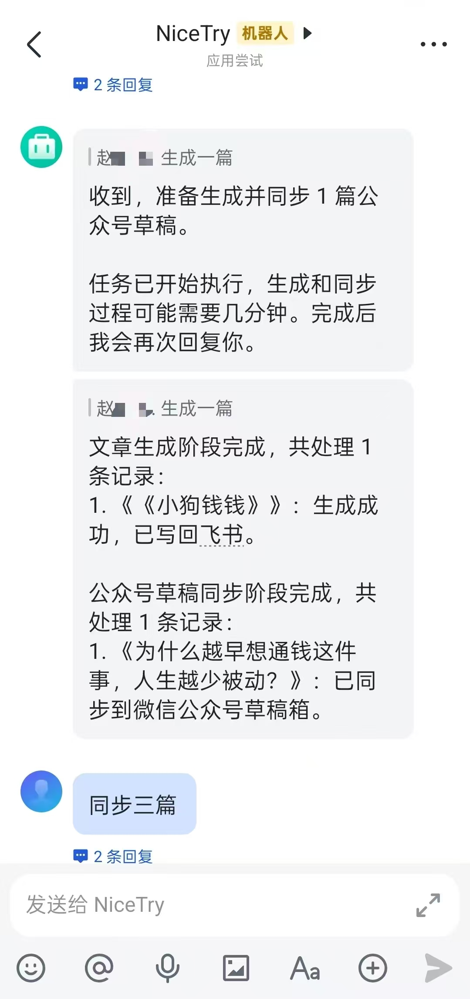
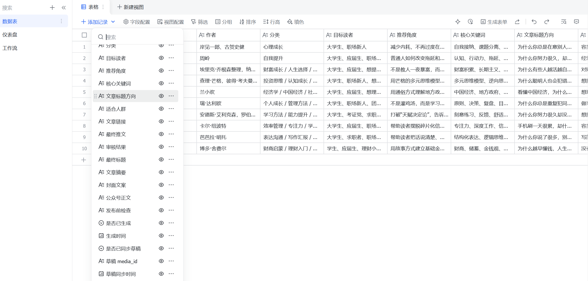
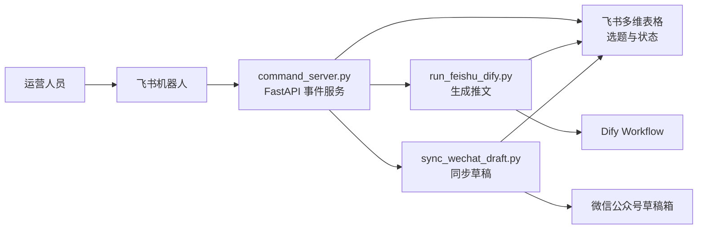

# 飞书机器人公众号读书推文自动生成 Agent

一个由飞书机器人触发的公众号读书推文自动生成 Agent。项目从飞书多维表格读取选题，通过 Dify Workflow 生成公众号文章，再将已生成内容同步到微信公众号草稿箱，并把处理状态回写到飞书表格。

## 项目展示




## 项目架构



## 核心功能

- 飞书机器人接收文本命令并异步执行任务。
- 从飞书多维表格读取未生成的读书选题。
- 调用 Dify Workflow 生成公众号推文、标题、摘要、封面文案和发布前检查。
- 将生成结果和失败原因回写到飞书表格。
- 将已生成但未同步的文章推送到微信公众号草稿箱。
- 支持查询当前选题库的生成与同步状态。

## 技术栈

- Python 3
- FastAPI
- Uvicorn
- Requests
- 飞书开放平台与多维表格 API
- Dify Workflow API
- RAG Dify中的Knowledge Retrieval
- 微信公众号草稿箱 API

## 主要文件说明

| 文件 | 说明 |
| --- | --- |
| `command_server.py` | 飞书机器人事件入口，解析命令并调度生成、同步、状态查询任务。 |
| `run_feishu_dify.py` | 从飞书表格读取选题，调用 Dify 生成推文，并回写生成结果。 |
| `sync_wechat_draft.py` | 读取已生成内容，转换为公众号 HTML，并同步到微信草稿箱。 |
| `test_wechat_token.py` | 本地验证微信公众号 access_token 获取流程。 |
| `test_wechat_upload_cover.py` | 本地验证公众号封面素材上传流程。 |
| `.env.example` | 环境变量模板，只包含占位值。 |
| `requirements.txt` | 项目运行所需的最小 Python 依赖。 |
| `dify/book_article_agent.dsl.yml` | Dify Workflow 导出文件，用于复现读书推文生成工作流。 |
| `dify/README.md` | Dify DSL 导入方式、输入变量和输出字段说明。 |
| `assets/cover.example.jpg` | 示例封面文件，可用于本地上传封面测试。 |
| `docs/images/` | README 展示图目录，当前仅保留占位路径。 |

## Dify 工作流复现

本仓库已包含可导入 Dify 的工作流 DSL：

- DSL 文件：[`dify/book_article_agent.dsl.yml`](dify/book_article_agent.dsl.yml)
- 导入说明：[`dify/README.md`](dify/README.md)

导入后需要在你自己的 Dify 工作区重新配置模型供应商凭据，并生成新的 Workflow API Key。把新的 API Key 写入本地 `.env` 的 `DIFY_API_KEY`，不要提交到 Git。

## 部署文档

推荐部署流程：

1. 准备 Python 3 运行环境。
2. 安装依赖：`pip install -r requirements.txt`。
3. 复制 `.env.example` 为 `.env`，并填入自己的飞书、Dify、微信公众号配置。
4. 在 Dify 中导入 [`dify/book_article_agent.dsl.yml`](dify/book_article_agent.dsl.yml)，发布工作流后更新 `DIFY_API_KEY`。
5. 使用 `uvicorn command_server:app --host 0.0.0.0 --port 8000` 启动飞书机器人事件服务。
6. 使用公网域名、反向代理或内网穿透工具，把 `/feishu/events` 暴露给飞书开放平台事件订阅。
7. 在飞书机器人里发送 `帮助`、`状态`、`生成一篇`、`同步一篇` 进行验证。

生产环境建议使用进程守护工具或容器托管服务运行，并为访问日志、错误日志、任务超时和重试失败配置告警。

## 飞书字段配置

飞书多维表格需要提前创建字段，字段名要与代码中的常量保持一致。字段设计见下方“飞书表格字段设计”章节；Dify 输入变量和输出字段映射见 [`dify/README.md`](dify/README.md)。

核心映射关系：

| 飞书字段 | 流向 | 说明 |
| --- | --- | --- |
| `书名`、`作者`、`分类`、`目标读者`、`推荐角度`、`核心关键词`、`文章标题方向`、`适合人群` | 飞书到 Dify | 拼接为 Dify 输入变量 `book_info`。 |
| `最终推文`、`审核结果`、`最终标题`、`文章摘要`、`封面文案`、`公众号正文`、`发布前检查`、`生成时间` | Dify 到飞书 | 生成成功后由 `run_feishu_dify.py` 回写。 |
| `是否已生成`、`是否已同步草稿`、`草稿 media_id`、`草稿同步时间`、`草稿同步失败原因` | 流程状态 | 用于筛选待处理记录和追踪同步结果。 |

## 飞书表格字段设计

建议在飞书多维表格中准备以下字段：

| 字段名 | 用途 |
| --- | --- |
| `书名` | 选题对应书籍名称。 |
| `作者` | 书籍作者。 |
| `分类` | 书籍或内容分类。 |
| `目标读者` | 推文面向的人群。 |
| `推荐角度` | 文章切入角度。 |
| `核心关键词` | 生成时需要覆盖的关键词。 |
| `文章标题方向` | 对标题风格或方向的要求。 |
| `适合人群` | 适合阅读或购买的人群描述。 |
| `是否已生成` | 生成状态，常用值：空、否、是、失败。 |
| `最终推文` | Dify 输出的完整推文。 |
| `审核结果` | Dify 或流程返回的审核信息。 |
| `最终标题` | 公众号标题。 |
| `文章摘要` | 公众号摘要。 |
| `封面文案` | 封面图文案建议。 |
| `公众号正文` | 可同步到公众号草稿的正文内容。 |
| `发布前检查` | 发布前风险或格式检查结果。 |
| `生成时间` | 内容生成完成时间。 |
| `是否已同步草稿` | 微信草稿箱同步状态，常用值：空、否、是、失败。 |
| `草稿 media_id` | 微信草稿箱返回的草稿 media_id。 |
| `草稿同步时间` | 草稿同步完成时间。 |
| `草稿同步失败原因` | 同步失败时记录错误摘要。 |

## 支持命令

在飞书机器人会话中发送：

- `生成一篇`：生成 1 篇公众号推文，并尝试同步到公众号草稿箱。
- `同步一篇`：只同步 1 篇已生成但未同步的推文到公众号草稿箱。
- `状态`：查看飞书选题库当前生成和同步状态。
- `帮助`：查看机器人支持的命令说明。

代码也支持类似 `生成两篇`、`生成三篇`、`同步两篇`、`同步三篇` 的数量命令。

## 运行方式

1. 安装依赖：

```bash
pip install -r requirements.txt
```

2. 创建本地环境变量文件：

```powershell
Copy-Item .env.example .env
```

3. 编辑 `.env`，填入你自己的飞书、Dify 和微信公众号配置。不要把 `.env` 提交到 Git。

4. 启动飞书事件服务：

```bash
uvicorn command_server:app --host 0.0.0.0 --port 8000
```

5. 将公网回调地址配置到飞书机器人事件订阅中，例如：

```text
https://your-domain.example/feishu/events
```

也可以直接运行脚本进行本地流程验证：

```bash
python run_feishu_dify.py
python sync_wechat_draft.py
python test_wechat_token.py
python test_wechat_upload_cover.py
```

## 当前版本状态

- 已具备飞书机器人命令入口。
- 已具备飞书表格读取、内容生成、状态回写流程。
- 已具备微信公众号草稿箱同步流程。
- 已提供 GitHub 公开仓库所需的 `.gitignore`、`.env.example`、`requirements.txt` 和 README 基础说明。

## 待加固事项

- 为飞书事件回调增加签名校验或回调 token 校验。
- 为长任务增加队列、任务锁和更明确的并发控制。
- 为飞书、Dify、微信 API 错误增加结构化日志与告警。
- 为核心解析函数和命令解析函数补充单元测试。
- 为微信草稿同步增加更完整的 HTML 样式与图片处理策略。
- 对 access_token 缓存、刷新和异常重试策略做统一封装。

## 后续规划

- 增加批量选题管理和人工审核状态。
- 支持按飞书记录 ID 精准生成或同步。
- 增加封面图自动生成和素材上传链路。
- 增加 GitHub Actions 的基本 lint/test 流程。
- 增加 Dockerfile 或部署脚本，简化服务上线。
- 增加 README 展示图，但只使用脱敏后的示例数据。

## 安全注意事项

- 不要提交 `.env`、真实密钥、token、AppSecret、access_token、media_id、open_id、tenant_key、飞书回调 token 或任何后台截图。
- `.env.example` 只能保留变量名和占位值。
- `WECHAT_DEFAULT_THUMB_MEDIA_ID` 即使不是密钥，也可能暴露公众号素材信息，公开前请使用示例值。
- 提交前请人工检查所有图片、日志、测试输出和临时文件。
- 如果密钥已经误提交到远程仓库，请立即在对应平台轮换密钥，并清理 Git 历史。
